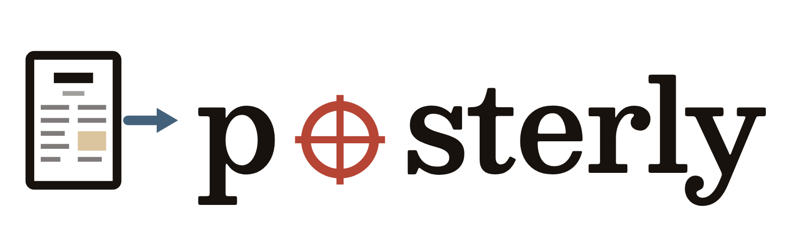
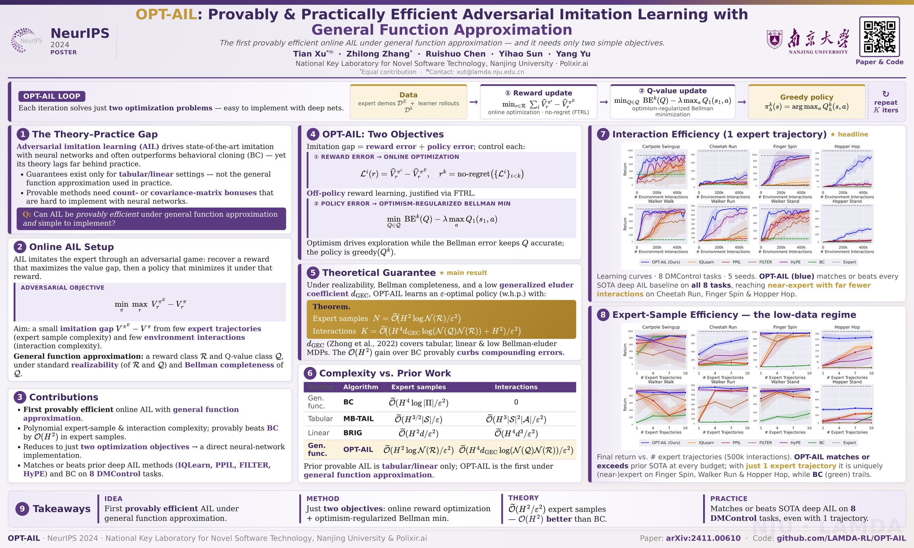

<h1 align="center">
  <picture>
    <source media="(prefers-color-scheme: dark)" srcset="docs/posterly-logo-dark.png">
    
  </picture>
</h1>

<p align="center"><b>Build academic conference posters as a single HTML/CSS file,<br>rendered to print-ready PDF via headless Chromium.</b></p>

<p align="center">
  <a href="LICENSE"></a>
  
  
</p>

**This is a coding-agent skill, not a hosted service.** Clone, install, and either invoke `/posterly` from your agent or call the CLIs directly. There is no cloud, no signup, no telemetry.

> [!NOTE]
> **Built with Claude, works with Codex too.** posterly is developed primarily with Claude (Opus 4.7 / 4.8), but in testing Codex (GPT-5.5) drives it just as well — and any coding agent with skill support should be fine. Hit a snag? A ⭐ and an issue are always welcome!

A poster in `posterly` is **one HTML file** styled for an exact print canvas. The skill ships three neutral templates, four sanity-check CLIs, and a render pipeline that produces a PDF at exact ICML / NeurIPS / ICLR / CVPR dimensions. Inside your agent, `/posterly` walks you through venue lookup → template pick → content fill → render — see `SKILL.md` for the full workflow it follows.

---

## Showcase

Three real conference posters — built with `posterly` from **publicly-available papers** (the authors' own) and shipped here as worked examples. Every one passes `preflight`, `measure`, and `polish`; click a thumbnail for the print-ready PDF, or open the editable source under `examples/`.

*Tooling: each was produced by **Claude Opus 4.7 / 4.8** (reasoning effort `xhigh`) driving `posterly`, with **GPT-5.5** (`xhigh`) as the secondary model for the paper-to-poster content audit.*

<p align="center">
  <a href="docs/showcase/powerflow_icml2026.pdf"></a><br>
  <b>PowerFlow: Unlocking the Dual Nature of LLMs via Principled Distribution Matching</b><br>
  ICML 2026 · Chen, Chen, Li, Huang (IIIS, Tsinghua) · <a href="https://arxiv.org/abs/2603.18363">arXiv</a> · <a href="https://github.com/Chenruishuo/PowerFlow">code</a> · <a href="examples/powerflow_icml2026/poster.html">source</a> · <a href="docs/showcase/powerflow_icml2026.pdf">PDF</a>
</p>

<p align="center">
  <a href="docs/showcase/tdgfn_icml2026.pdf"></a><br>
  <b>Beyond the Proxy: Trajectory-Distilled Guidance for Offline GFlowNet Training (TD-GFN)</b><br>
  ICML 2026 · Chen, Wang, Hu, Li, Huang (IIIS, Tsinghua) · <a href="https://arxiv.org/abs/2505.20110">arXiv</a> · <a href="https://github.com/Chenruishuo/TD-GFN">code</a> · <a href="examples/tdgfn_icml2026/poster.html">source</a> · <a href="docs/showcase/tdgfn_icml2026.pdf">PDF</a>
</p>

<p align="center">
  <a href="docs/showcase/optail_neurips2024.pdf"></a><br>
  <b>OPT-AIL: Provably &amp; Practically Efficient Adversarial Imitation Learning with General Function Approximation</b><br>
  NeurIPS 2024 · Xu, Zhang, Chen, Sun, Yu (Nanjing University · Polixir.ai) · <a href="https://arxiv.org/abs/2411.00610">arXiv</a> · <a href="https://github.com/LAMDA-RL/OPT-AIL">code</a> · <a href="examples/optail_neurips2024/poster.html">source</a> · <a href="docs/showcase/optail_neurips2024.pdf">PDF</a>
</p>

> [!TIP]
> A **theory-heavy** paper — loss functions, optimism-regularized Bellman error, eluder coefficients, complexity tables, theorem boxes — all typeset via MathJax and clearing every gate. Drafted end-to-end (paper → print-ready PDF) in **1 h 11 m**.

The ICML posters are four-column landscape; OPT-AIL is three-column. All carry the `data-measure-role` markup the gates read and double as the largest end-to-end fixtures in the repo: copy one, swap in your content, and re-render with `tools/render_preview.py examples/<name>/poster.html`.

---

## Also built with Codex — community

Proof the Codex path holds up outside our own tests: a community contributor drove `posterly` end-to-end with **Codex (GPT-5.5)** — no Claude in the loop — to turn their ICML 2026 paper into this poster.

<p align="center">
  <a href="docs/community/cflower_icml2026.pdf"></a><br>
  <b>Improving LLM-Based Recommenders with Conservative Generative Flow Networks (CFlower)</b><br>
  ICML 2026 · Yu, Niu, Zhu, Zhang, Wang, Wang (USTC) · <a href="https://github.com/yuxuan9982/CFlower">code</a> · <a href="docs/community/cflower_icml2026.pdf">PDF</a>
</p>

Built one with Codex (or any other agent)? Open a PR or an issue — we'd love to feature it here.

---

## Why HTML + CSS, not LaTeX?

- **Tweak loop in seconds, not minutes.** Edit CSS, refresh — vs. LaTeX `recompile + scan log + re-open PDF`.
- **Modern layout primitives.** Flexbox, grid, gradients, `text-wrap: balance`, web-fonts — all things LaTeX poster classes (`tcbposter`, `tikzposter`, `beamerposter`) either don't have or need package-on-package for.
- **Programmatically lintable.** Every "is this column overflowing?" check that you'd do by squinting at a PDF is a Playwright geometry query here.
- **Exact print output.** `@page { size: 60in 36in }` + Chromium's `page.pdf()` produces a PDF whose dimensions are exactly the canvas — not "approximately A0 after scaling".

Trade-off: no native math typesetting; templates load MathJax 3 from a CDN by default. To go offline, download a MathJax v3 release and change the template's `<script src=…>` to `mathjax/es5/tex-svg.js` — there's an inline comment next to the CDN link in each template showing exactly which line to edit.

---

## Install

**The lazy way — hand it to your agent.** Paste this to your coding agent (Claude, Codex, …):

> Install this skill for me: https://github.com/Chenruishuo/posterly

It will clone the repo into `~/.claude/skills/`, install the Python deps, and run the smoke test. The manual steps below are the fallback (or for a non-agent setup).

```bash
# 1. Clone into ~/.claude/skills/ for Claude Code auto-discovery
#    (other agents: point them at this dir however they load skills)
git clone https://github.com/Chenruishuo/posterly ~/.claude/skills/posterly
cd ~/.claude/skills/posterly

# 2. Python deps
python -m pip install "playwright>=1.40"
python -m playwright install chromium
# On a fresh Linux box you may also need the system libs Chromium links against:
#   python -m playwright install --with-deps chromium
#   # or sudo apt install libnss3 libatk1.0-0 libatk-bridge2.0-0 libcups2 \
#   #                     libdrm2 libxkbcommon0 libxcomposite1 libxdamage1 \
#   #                     libxrandr2 libgbm1 libpango-1.0-0 libcairo2 libasound2

# 3. System dep for verify-final's pdfinfo
#    Linux:   apt install poppler-utils
#    macOS:   brew install poppler
#    Windows: choco install poppler

# 4. Smoke test
cd examples/hello_world
python ../../tools/poster_check.py preflight  poster.html
python ../../tools/poster_check.py measure    poster.html
python ../../tools/poster_check.py polish     poster.html
python ../../tools/render_preview.py          poster.html
python ../../tools/poster_check.py verify-final poster_preview.pdf --from-html poster.html

# 5. (dev) run the test suite
python -m pip install "pytest>=7" && python -m pytest
```

All four `poster_check.py` calls should print `PASS` and `render_preview.py` should write `poster_preview.pdf` + `poster_preview.png` into the directory. If that works, install is good.

**Tests (dev):** posterly is clone-only — no PyPI; `pyproject.toml` holds the deps + pytest config. The suite covers the four gates' logic plus Poppler- and Chromium-gated end-to-end checks against `examples/hello_world` (auto-skipped when those binaries aren't present).

---

## Make your poster

Once installed, just point your agent at the paper's source directory:

> /posterly — make my ICML 2026 poster from the LaTeX project at ~/papers/mypaper/. Logos are in ~/papers/mypaper/logos/, QR should point to https://github.com/you/yourcode

The paper source is the only required input — hand over the LaTeX project directory (an easily-parsed format like Word should also do) and posterly reads the actual source, so numbers and claims come from the paper, not from memory. Logos and the QR target URL are optional: anything you don't hand over up front, the skill asks about in one batch of design questions before it starts (and degrades gracefully if the answer is "none" — text venue badge, no empty logo/QR boxes).

> [!NOTE]
> Building straight from a **PDF** is untested. It may still work if your agent has a screenshot / figure-extraction tool, or if the poster doesn't need to reuse the paper's figures — if you try it, an issue with your result is welcome!

---

## What's in here

```
posterly/
├── SKILL.md             ← workflow your agent follows when you /posterly
├── tools/
│   ├── poster_check.py  ← preflight / measure / polish / verify-final CLIs
│   ├── render_preview.py← print-emulated PDF + thumbnail PNG
│   └── _posterly/       ← internal modules
├── templates/           ← landscape_4col, landscape_hero, portrait_2col
├── examples/
│   ├── hello_world      ← smallest poster that clears every gate (install check)
│   ├── powerflow_icml2026 ← real ICML 2026 poster (4-col landscape)
│   ├── tdgfn_icml2026     ← real ICML 2026 poster (4-col landscape)
│   └── optail_neurips2024 ← real NeurIPS 2024 poster (3-col, math-heavy)
├── docs/showcase/       ← rendered PDFs + thumbnails for the showcase above
└── tests/               ← pytest suite (canvas / preflight / polish / verify-final)
```

The four sanity-check CLIs at a glance:

- `preflight`     — static lint: LaTeX residue, raw `<` inside math, missing local images, remote-image warnings (a print poster should be self-contained), missing `data-measure-role` markup.
- `measure`       — print-emulated geometry: column-bottom spread, gap to footer, poster bbox aligned to the page.
- `polish`        — soft visual checks: figure-AR sizing, broken/zero-size images (FIG/BROKEN), typography orphans, space-between fill, card trailing whitespace (CARD/TRAILING — a stretched card padded with blank space).
- `verify-final`  — `pdfinfo`-based PDF sanity: page count, dimensions, file size.

Three further **optional** gates layer on top — `run_gates.py` (runs them all in one report), `style_check.py` (hard design-token gate), and `asset_check.py` (real-figure provenance) — documented in `SKILL.md`.

Detailed thresholds and tuning flags are in `SKILL.md`. See `templates/README.md` for the template gallery and the conventions a new template must follow.

---

## Customizing your poster

The three knobs you'll actually touch:

- **Colors / fonts**: edit `:root` design tokens (`--accent`, `--gold`, `--font-serif`, …) in the template you copied.
- **Logos**: drop into the same directory as `poster.html`, reference as `images/your_logo.png`.
- **QR code**: give `/posterly` your paper/code URL and Claude generates the QR for you — the showcase posters' codes were made this way. Templates ship an inline SVG placeholder so they render offline; to make one by hand, `qrencode -o qr.png -s 12 "<url>"` (Linux) or `python -c "import qrcode; qrcode.make('<url>').save('qr.png')"`, then point the QR `` at it.

---

## License

posterly is licensed as a whole under the **GNU Affero General Public License
v3.0** (AGPL-3.0) © 2026 Ruishuo Chen — see [LICENSE](LICENSE). You may use,
modify, and commercialize it, **but any distributed or network-deployed (SaaS)
derivative must release its complete corresponding source under the same
license**. This is deliberate: it keeps posterly open and prevents closed-source
commercial exploitation.

This repository also vendors a few **MIT-licensed** gate tools from
[ARIS](https://github.com/wanshuiyin/Auto-claude-code-research-in-sleep); those
specific files remain available under their original MIT license. MIT is
GPL/AGPL-compatible, so the project as a whole is AGPL-3.0 while the vendored
files stay individually MIT. Details: [NOTICE.md](NOTICE.md) and
[LICENSES/](LICENSES/).
